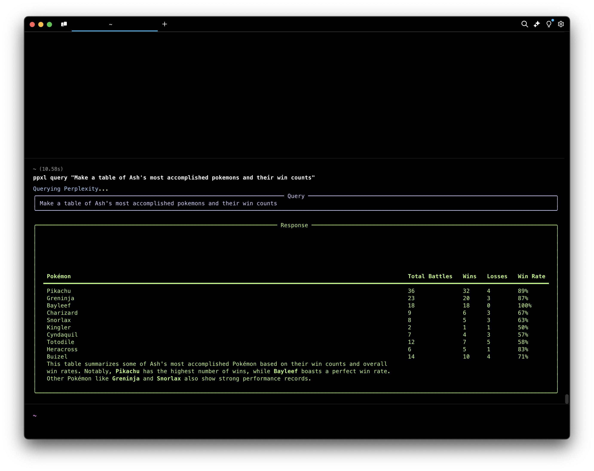

# PPXL - Terminal AI Assistant

Access a powerful AI assistant directly from your terminal with beautiful formatting.



## Legal Disclaimer

This tool is provided for educational purposes only. Users must:
- Comply with target website's Terms of Service
- Use reasonable request frequencies
- Accept responsibility for usage
- Not use for commercial data collection
- Ensure compliance with local laws and regulations

## Ethical Browser Automation Guidelines

This tool strictly adheres to the following browser automation principles:

**Rate Limiting**
- Implements configurable delay between requests controlled by cloudflare
- Respects server-side rate limiting
- No parallel request processing

**Robots.txt Compliance**
- Follows website's robots.txt directives
- Only accesses publicly available endpoints
- No scraping of restricted content

**Transparency**
- User-Agent clearly identifies automated nature
- No masking or spoofing of request origins
- Uses user's local browser installation for authenticity

**Request Handling**
- Implements exponential backoff for failures
- Proper error handling and graceful termination
- No aggressive retry mechanisms

**Proxy Usage & Security**
- No bypass of security measures
- Cloudflare challenges handled by user
- No storage of sensitive information

## Security & Compliance

### Legal Compliance
PPXL operates in full compliance with web service terms and conditions:
- Respects security challenges
- Shows verification prompts when required
- Does not bypass or automate security measures
- Uses standard web protocols and interfaces

### Virus Scan Results
Each release is scanned with multiple antivirus engines:
- [VirusTotal Report](https://www.virustotal.com/gui/file/bb595dd248f36b721d4f777ea0d8d55786aeae98006f6e1b718fe51b167febe9?nocache=1)
- [Jotti's malware scan](https://virusscan.jotti.org/en-US/filescanjob/9cqqpkod1x)

## Installation

### Using Homebrew (macOS)
```bash
brew tap abhishekbhakat/tap
brew install ppxl
```

### Manual Installation
1. Download the appropriate binary for your system from the [releases page](https://github.com/abhishekbhakat/ppxl/releases)
2. Make it executable: `chmod +x ppxl`
3. Move to your PATH: `sudo mv ppxl /usr/local/bin/`

## Usage

```bash
# Basic query
ppxl query "your question here"

# Show version
ppxl version

# Enable debug mode
ppxl query --debug "your question here"

# Use custom Chrome path
ppxl query --chrome-path "/path/to/chrome" "your question here"

# Show help
ppxl --help
```

## Features

- Clean, formatted output using Rich
- Table support for structured data
- Error handling with user-friendly messages
- Debug mode for troubleshooting
- Custom Chrome path support

## Support

- For feature requests, please use our [feature request template](.github/ISSUE_TEMPLATE/feature_request.md)
- For bug reports, use our [bug report template](.github/ISSUE_TEMPLATE/bug_report.md)
- For security concerns, see our [security policy](SECURITY.md)

## Credits

This project was developed with assistance from [Kodu.ai](https://kodu.ai), an AI pair programming assistant that helped with:
- Project structure and organization
- Code implementation and testing
- Documentation and release management
- Build system configuration

## License

Proprietary. All rights reserved.

---

**Note on Source Code Availability**: To maintain the integrity of browser automation practices and ensure ethical usage, the source code for this project is intentionally kept private. This decision helps prevent potential misuse, abuse of the services and ensures compliance with ethical automation guidelines.
